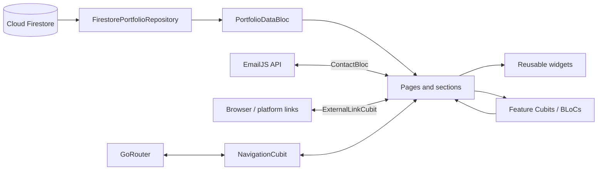

# Flutter Developer Portfolio

A production-oriented sample portfolio built with Flutter Web. It presents a
developer's professional experience, technical capabilities, services,
projects, case studies, testimonials, and contact options through a dark,
editorial interface backed by Firebase.

> **Sample data notice:** names, email addresses, URLs, project details, and
> professional information in this README are fictional placeholders. Replace
> them with your own information when configuring a fork.

> **Display support:** the main portfolio currently targets browser windows at
> least **900 px wide**. Smaller viewports intentionally show a desktop
> experience notice. The responsive system still distinguishes tablet, desktop,
> and wide-desktop layouts above that minimum.

## Table of contents

- [Overview](#overview)
- [Features](#features)
- [Theme and visual language](#theme-and-visual-language)
- [Technology stack](#technology-stack)
- [Architecture](#architecture)
- [Project structure](#project-structure)
- [Routes](#routes)
- [Getting started](#getting-started)
- [Firebase and Firestore setup](#firebase-and-firestore-setup)
- [EmailJS contact form](#emailjs-contact-form)
- [Content and asset customization](#content-and-asset-customization)
- [Development and quality checks](#development-and-quality-checks)
- [Production build](#production-build)
- [Deployment](#deployment)
- [Accessibility and behavior](#accessibility-and-behavior)
- [Troubleshooting](#troubleshooting)
- [Contributing and license](#contributing-and-license)

## Overview

This repository is primarily a Flutter Web application and also contains the
generated Android and iOS runners. Portfolio content is not hard-coded into the
pages: it is read in real time from Cloud Firestore, normalized into typed Dart
models, and distributed to the interface through BLoC state.

The page is organized as a long-form, scroll-driven experience:

1. Hero
2. About
3. Skills and capabilities
4. Specialized services
5. Featured projects
6. Experience and education
7. Client testimonials
8. Contact
9. Footer

Dedicated pages provide the complete project archive, individual case studies,
testimonial submission, and a custom not-found state.

## Features

- Real-time portfolio content from Cloud Firestore
- Branded loading, retry, empty, and failure states
- URL-aware section navigation with clean browser paths
- Scroll progress indicator and active-section synchronization
- Searchable and category-filtered project archive
- Project destinations for source code, live sites, app stores, and pub.dev
- Per-project case studies with challenge, solution, architecture, and results
- EmailJS-powered contact form
- Firestore-backed testimonial submission flow
- Downloadable résumé with Google Drive sharing-link normalization
- Local and remote image support, including Google Drive image links
- Animated typewriter copy, section reveals, hover states, and page transitions
- Persistent résumé control and back-to-top navigation
- PWA metadata, application icons, social metadata, and a service worker
- SPA route fallback for GitHub Pages

## Theme and visual language

The visual system is a permanent Material 3 dark theme with a restrained
black-and-red palette. It combines dense editorial display typography with
highly legible body copy, subtle borders, compact radii, a grid backdrop, and
red interaction accents.

### Color palette

| Token | Hex | Purpose |
| --- | --- | --- |
| `background` | `#080808` | Page and canvas background |
| `surface` | `#121212` | Cards, fields, and primary surfaces |
| `elevatedSurface` | `#181818` | Tooltips and elevated elements |
| `accent` | `#E50914` | Primary actions, progress, focus, and highlights |
| `accentBright` | `#FF1E2D` | Secondary accent and error emphasis |
| `textPrimary` | `#FFFFFF` | Headings and high-emphasis content |
| `textSecondary` | `#B5B5B5` | Body copy |
| `textMuted` | `#727272` | Supporting labels and low-emphasis text |
| `success` | `#22C55E` | Positive feedback |
| `border` | `rgba(255,255,255,0.08)` | Subtle separators |
| `borderStrong` | `rgba(255,255,255,0.15)` | Controls and card outlines |

Theme tokens live in
[`lib/core/theme/app_colors.dart`](lib/core/theme/app_colors.dart), while the
complete Material configuration is in
[`lib/core/theme/app_theme.dart`](lib/core/theme/app_theme.dart).

### Typography

- **Space Grotesk** — display headings, section titles, and prominent labels
- **Inter** — body content, controls, and supporting text
- **Monospace system face** — small technical metadata in selected components

Both primary font families are bundled as variable TTF files under
`assets/fonts/`, so the interface does not depend on a third-party font CDN.
Display headings use heavy weights, compact line heights, and negative letter
spacing. Body styles use generous line heights for readability.

### Spacing and layout

The layout uses a four-pixel-based spacing scale and a three-pixel corner
radius. Important dimensions include:

| Setting | Value |
| --- | ---: |
| Minimum portfolio width | `900 px` |
| Compact desktop boundary | `1120 px` |
| Desktop breakpoint | `1200 px` |
| Wide desktop breakpoint | `1600 px` |
| Maximum content width | `1280 px` |
| Maximum reading width | `680 px` |
| Navigation height | `80 px` |
| Standard section padding | `112 px` |
| Wide section padding | `128 px` |

The breakpoint registration in `app.dart` is:

- Mobile: `0–899 px`
- Tablet: `900–1199 px`
- Desktop: `1200–1599 px`
- Wide desktop: `1600 px` and above

### Motion

Motion is used as progressive enhancement rather than as a content gate.
Sections fade and slide into place when visible, cards respond to hover, the
hero includes typewriter and portrait motion, and secondary pages use short
fade/slide transitions. Core reveal and loader animations honor the platform's
reduced-motion preference.

## Technology stack

| Area | Technology |
| --- | --- |
| UI framework | Flutter with Material 3 |
| Language | Dart |
| State management | `flutter_bloc` |
| Routing | `go_router` with path URL strategy |
| Responsive layout | `responsive_framework` |
| Backend/content | Firebase Core and Cloud Firestore |
| Contact delivery | EmailJS REST API through `http` |
| SVG rendering | `flutter_svg` |
| External links | `url_launcher` |
| Scroll visibility | `visibility_detector` |
| Hosting | GitHub Pages through GitHub Actions |

The exact dependency constraints and Dart SDK requirement are defined in
[`pubspec.yaml`](pubspec.yaml). The project currently requires Dart
`^3.11.5`; use a compatible stable Flutter SDK.

## Architecture

The code follows a layered, feature-oriented structure:



### Layer responsibilities

- **Core** contains theme tokens, routing, animation primitives, constants, and
  shared utilities.
- **Data** contains Firestore repository implementations, EmailJS delivery, and
  typed serialization models.
- **Domain** defines repository and service contracts.
- **Presentation** contains pages, sections, reusable widgets, and BLoC/Cubit
  state.

`PortfolioDataBloc` subscribes to ten Firestore streams. It does not expose the
application until every required document and collection has emitted its first
value. Subsequent Firestore snapshots update the visible portfolio in real time.
Collection content is filtered by `enabled` and sorted by ascending `order`.

## Project structure

```text
portfolio/
├── .github/workflows/dart.yml      # Build and GitHub Pages deployment
├── android/                        # Android runner and Firebase config
├── assets/
│   ├── fonts/                      # Inter and Space Grotesk
│   ├── icons/                      # SVG icon system
│   └── images/                     # Brand, portrait, and project artwork
├── ios/                            # iOS runner and Firebase config
├── lib/
│   ├── core/
│   │   ├── animations/             # Visibility-based section reveals
│   │   ├── constants/              # Local labels, enums, Firestore names
│   │   ├── routing/                # Routes and GoRouter configuration
│   │   ├── theme/                  # Colors, typography, spacing, Material theme
│   │   └── utils/                  # URL, image, and model helpers
│   ├── data/
│   │   ├── models/                 # Firestore-backed immutable models
│   │   ├── repositories/           # Firestore implementation
│   │   └── services/               # EmailJS implementation
│   ├── domain/                     # Repository and service abstractions
│   ├── presentation/
│   │   ├── blocs/                  # App and feature state management
│   │   ├── pages/                  # Portfolio and secondary pages
│   │   └── widgets/                # Shared visual components
│   ├── app.dart                    # App theme, breakpoints, and root providers
│   ├── firebase_options.dart       # FlutterFire-generated platform options
│   └── main.dart                   # Firebase initialization and entry point
├── web/                            # Web shell, manifest, icons, bootstrapping
├── firebase.json                   # FlutterFire platform configuration
└── pubspec.yaml                    # SDK, packages, fonts, and asset registration
```

## Routes

The application uses browser-friendly paths with Flutter's path URL strategy.

| Route | Purpose |
| --- | --- |
| `/` | Hero/home section |
| `/about` | Portfolio opened at About |
| `/skills` | Portfolio opened at Skills |
| `/services` | Portfolio opened at Services |
| `/projects` | Portfolio opened at Featured Projects |
| `/experience` | Portfolio opened at Experience |
| `/contact` | Portfolio opened at Contact |
| `/projects/all-projects` | Searchable and filterable project archive |
| `/projects/:slug` | Project case study |
| `/testimonials/submit-testimonial` | Testimonial submission form |
| Any unknown path | Custom 404 page |

Section paths all render the same scrollable portfolio and then move to the
requested section. As the user scrolls, the active path is replaced in the
browser without filling the history stack.

## Getting started

### Prerequisites

- Flutter stable with a Dart SDK compatible with `^3.11.5`
- A browser supported by Flutter Web
- A Firebase project with Cloud Firestore enabled
- FlutterFire CLI if connecting a different Firebase project
- An EmailJS account if contact-form delivery is required

Check your local toolchain:

```bash
flutter doctor
flutter --version
```

The checked-in `firebase_options.dart` currently identifies the portfolio's
configured Firebase project. For a fork, connect your own project before
running the app and populate the required Firestore data described below.

To use a fixed web port:

```bash
flutter run -d chrome --web-port 8080
```

## Firebase and Firestore setup

### Connect a Firebase project

Install and authenticate the Firebase and FlutterFire CLIs, then run:

```bash
flutterfire configure
```

Select the platforms you intend to support. This regenerates
`lib/firebase_options.dart` and the relevant native configuration files.
Firebase client configuration contains identifiers used by the client SDK; data
security must be enforced with Firestore Security Rules, not by hiding those
values.

### Required database shape

The application reads these top-level collections:

```text
about/
  main
  emailJs
  links
  stats
  contactChannels
experiences/{documentId}
projects/{documentId}
services/{documentId}
skillGroups/{documentId}
testimonials/{documentId}
```

All five named documents under `about` are required. The other collections may
be empty, but they must be readable so their snapshot streams can emit.

#### `about/main`

```json
{
  "firstName": "Alex",
  "lastName": "Morgan",
  "title": "Flutter Developer",
  "subtitle": "I create polished, maintainable cross-platform products.",
  "aboutBrief": "A short introduction to the sample developer.",
  "aboutLong": "A longer sample biography covering experience and interests.",
  "email": "developer@example.com",
  "portraitAsset": "assets/images/profile.png",
  "logoAsset": "assets/images/logo.png",
  "roles": ["Flutter Developer", "Cross-platform Engineer"],
  "coreFocus": ["App architecture", "Responsive UI", "Product delivery"]
}
```

The logo shown by the application is intentionally overridden by the local
`assets/images/logo.png` value in `PortfolioLocalContent`. `portraitAsset` can
be a bundled asset path, an HTTP(S) image, or a supported Google Drive sharing
URL.

#### `about/links`

```json
{
  "github": "https://github.com/your-username",
  "linkedin": "https://www.linkedin.com/in/your-profile",
  "pubDev": "https://pub.dev/publishers/your-domain.example/packages",
  "resumeUrl": "https://drive.google.com/file/d/FILE_ID/view"
}
```

Standard Google Drive résumé links are converted to direct-download URLs when
possible. Other valid HTTPS file URLs are left unchanged.

#### `about/emailJs`

```json
{
  "serviceId": "service_xxxxx",
  "templateId": "template_xxxxx",
  "publicKey": "your_emailjs_public_key",
  "nameParameter": "from_name",
  "emailParameter": "reply_to",
  "subjectParameter": "subject",
  "messageParameter": "message"
}
```

All seven values are required for contact delivery.

#### `about/stats`

```json
{
  "items": [
    {
      "value": "5+",
      "label": "Years of experience",
      "iconName": "calendar",
      "order": 0,
      "enabled": true
    }
  ]
}
```

#### `about/contactChannels`

```json
{
  "items": [
    {
      "label": "Email",
      "value": "developer@example.com",
      "url": "mailto:developer@example.com",
      "iconName": "email",
      "order": 0,
      "enabled": true
    }
  ]
}
```

#### Collection document fields

| Collection | Fields |
| --- | --- |
| `experiences` | `period`, `title`, `context`, `description`, `highlights[]`, `kind`, `order`, `enabled` |
| `services` | `title`, `description`, `iconName`, `order`, `enabled` |
| `skillGroups` | `title`, `iconName`, `skills[{name, iconName}]`, `order`, `enabled` |
| `testimonials` | `name`, `role`, `company`, `content`, `rating`, `avatar`, `order`, `enabled` |
| `projects` | `slug`, `title`, `description`, `details`, `tags[]`, `category`, destination fields, case study, `featured`, `order`, `enabled` |

Valid `experiences.kind` values are `practice` and `milestone`. Valid project
categories are `packages`, `mobile`, `integrations`, and `ui`. Unknown project
categories fall back to `ui`.

A representative project document:

```json
{
  "slug": "sample-app",
  "title": "Sample App",
  "description": "A short project summary.",
  "details": "A more complete explanation of the product and contribution.",
  "tags": ["Flutter", "Firebase", "BLoC"],
  "category": "mobile",
  "url": "https://example.com",
  "destinationLabel": "View project",
  "iconName": "mobile",
  "code": "APP-01",
  "imageUrl": "assets/images/projects/sample-thumbnail.jpg",
  "appStoreUrl": null,
  "playStoreUrl": "https://play.google.com/store/apps/details?id=example",
  "pubDevUrl": null,
  "liveUrl": "https://example.com",
  "projectType": "Mobile application",
  "sourceUrl": "https://github.com/your-username/sample-app",
  "caseStudy": {
    "role": "Lead Flutter Developer",
    "timeline": "12 weeks",
    "challenge": "The problem and product constraints.",
    "solution": "The implementation and design approach.",
    "architecture": ["Feature-first modules", "BLoC", "Repository pattern"],
    "results": [
      {
        "metric": "40%",
        "label": "Faster completion",
        "order": 0,
        "enabled": true
      }
    ],
    "enabled": true
  },
  "featured": true,
  "order": 0,
  "enabled": true
}
```

If `slug` is empty, it is generated from the title. If a configured case study
is absent or unavailable, the model creates a basic fallback from the project's
description, type, and technologies.

### Security rules

This repository does not currently contain a Firestore rules file. Before
deploying a fork, define rules that:

- allow public reads only for content intended to be public;
- validate testimonial fields and permitted sizes before allowing creation;
- prevent unauthenticated edits or deletes;
- restrict administrative writes to trusted users or server-side tooling; and
- apply abuse protection to public forms.

Do not use unrestricted development rules in production. Testimonial
submissions are currently written with `enabled: true`, so review the desired
moderation behavior together with your rules and UI before accepting public
traffic.

## EmailJS contact form

The contact form posts directly to EmailJS's `/api/v1.0/email/send` endpoint.
The service ID, template ID, public key, and template parameter names come from
`about/emailJs`.

In the EmailJS dashboard:

1. Create and connect an email service.
2. Create a template with name, reply-to email, subject, and message variables.
3. Add the matching variable names to the Firestore document.
4. Add the deployed domain to the EmailJS origin allowlist.
5. Test both successful delivery and error feedback.

An EmailJS public key is designed for client use, but it is not an authorization
boundary. Use EmailJS domain restrictions, rate limits, and any available abuse
protections.

## Content and asset customization

### Change portfolio content

Edit Firestore for profile, links, statistics, contact channels, experience,
projects, services, skills, and testimonials. Changes propagate through live
snapshot streams without rebuilding the site.

Local navigation labels and section headings are defined in
`lib/core/constants/portfolio_local_content.dart`.

### Change the theme

- Colors: `lib/core/theme/app_colors.dart`
- Typography: `lib/core/theme/app_typography.dart`
- Material component theme: `lib/core/theme/app_theme.dart`
- Spacing, breakpoints, widths, and radii:
  `lib/core/theme/app_spacing.dart`

After changing web brand colors, keep `web/index.html` and `web/manifest.json`
in sync so browser chrome, launch surfaces, and the Flutter canvas match.

### Add an icon

1. Add an SVG to `assets/icons/`.
2. Store its filename without `.svg` in the relevant Firestore `iconName`.
3. Rebuild the app.

`AppIcon` resolves names as `assets/icons/<iconName>.svg` and displays the
`brokenImage.svg` fallback when the requested icon cannot be rendered.

### Add project artwork

Place local artwork in `assets/images/projects/` and set `imageUrl` to the asset
path, or supply an HTTP(S)/Google Drive image URL. New asset directories must
also be registered in `pubspec.yaml`.

### Update web identity

Edit:

- `web/index.html` for title, description, Open Graph, Twitter, and theme tags;
- `web/manifest.json` for installable-app identity and colors;
- `web/favicon.png` and `web/icons/` for browser and PWA icons; and
- `MaterialApp.router.title` in `lib/app.dart`.

## Development and quality checks

Format, analyze, and test before opening a pull request:

```bash
dart format --output=none --set-exit-if-changed .
flutter analyze
flutter test
```

There is currently no `test/` suite in the repository, so `flutter test` becomes
useful after tests are added. At minimum, future coverage should include model
normalization, Google Drive URL conversion, project filtering, Firestore
failure states, contact validation, and route/scroll synchronization.

For a quick release-mode browser check:

```bash
flutter run -d chrome --release
```

Verify loading, direct links, section routes, project filters, case studies,
external destinations, résumé download, contact delivery, testimonial writes,
404 behavior, keyboard focus, and reduced motion.

## Production build

For root-domain hosting:

```bash
flutter build web --release
```

For GitHub project pages, the base path must match the repository name:

```bash
flutter build web --release --base-href "/portfolio/"
cp build/web/index.html build/web/404.html
```

The generated site is written to `build/web/`. The copied `404.html` lets
GitHub Pages return the Flutter shell for deep links such as
`/portfolio/projects/sample-app`, after which `go_router` resolves the route.

If the repository or hosting subdirectory changes, update `--base-href` in
`.github/workflows/dart.yml`.

## Deployment

The workflow at `.github/workflows/dart.yml` deploys to GitHub Pages on every
push to `main` and can also be started manually:

1. Check out the repository.
2. Install and cache stable Flutter.
3. Resolve dependencies.
4. Build the release web bundle with `/portfolio/` as the base href.
5. Create the SPA `404.html` fallback.
6. Upload the Pages artifact.
7. Deploy through GitHub's `github-pages` environment.

To enable it in a fork, open **Repository Settings → Pages** and select
**GitHub Actions** as the source. Ensure the configured Firebase project permits
requests from the deployed origin and that Firestore and EmailJS rules are ready
for public traffic.

## Accessibility and behavior

- Images provide semantic labels where they communicate identity or content.
- Buttons and icon controls include labels or tooltips.
- Focus, hover, error, and success states use more than motion alone.
- Core entrance animations respect `MediaQuery.disableAnimations`.
- Reveal animations begin partially visible, keeping content readable if a
  browser throttles animation callbacks.
- External link schemes are limited to `http`, `https`, `mailto`, and `tel`.
- The desktop-only fallback remains readable on widths below 900 px.

The current design is not a complete mobile portfolio. Supporting narrow screens
requires responsive versions of the main sections rather than merely changing
the registered breakpoints.

## Troubleshooting

### The app remains on the loader

Confirm that Firebase initializes, all five `about/*` documents exist, and the
five content collections are readable. The root state waits for an initial
snapshot from all ten sources.

### “Required portfolio data is missing from Firestore”

At least one required `about` document is absent. Create `main`, `emailJs`,
`links`, `stats`, and `contactChannels` using the schema above.

### “The portfolio data could not be loaded”

Check the browser console, Firebase project selection, allowed origins,
Firestore rules, network access, and field types.

### A direct link returns 404

Verify the deployment contains `404.html`, the build base href matches the
hosting subdirectory, and the host supports an SPA fallback.

### Images or icons show a broken-image symbol

Check spelling and letter case, confirm local paths are registered under
`flutter.assets`, and make sure remote hosts allow browser access. For icons,
store only the SVG filename without the extension.

### The résumé opens instead of downloading

Google Drive may display confirmation or malware-scan interstitials for some
files. Confirm the file is shared publicly and test the generated link in a
private browser session.

### Contact messages fail

Verify all `about/emailJs` fields, template variable names, EmailJS service
status, origin restrictions, quota, and browser network logs.

### Content changes do not appear in order

Set numeric `order` fields. Only documents with `enabled: true` are shown, and
enabled items are sorted in ascending order.

## Contributing and license

Contributions are welcome through focused issues and pull requests. Keep content
credentials and unrelated local changes out of commits, run the quality checks,
and include before/after captures for visual changes.

No open-source license is currently included. Copyright remains with the
repository owner unless a license is added; contact the owner before reusing or
redistributing the code.
